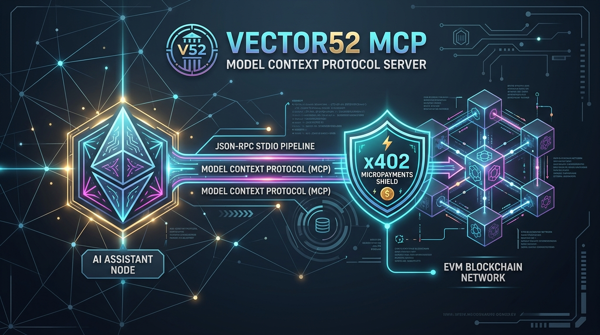
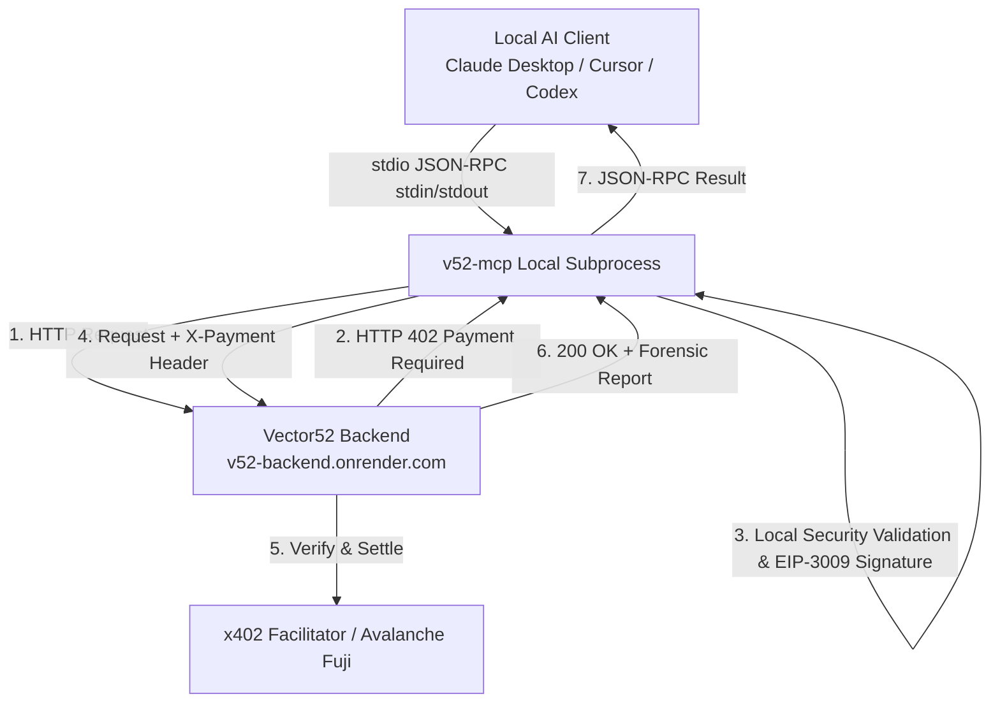
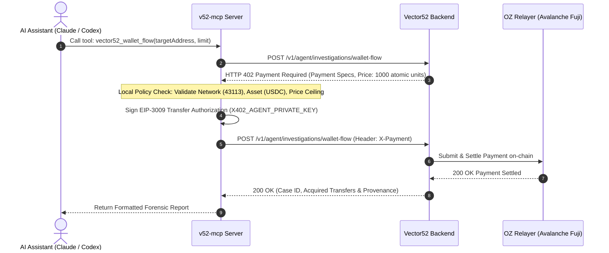

<div align="center">

# 🤖 Vector52 MCP Server — Model Context Protocol with Autonomous x402 Micropayments

**"Autonomous Web3 Forensic Audit Agent Server over stdio JSON-RPC"**

[](https://nodejs.org/)
[](https://www.typescriptlang.org/)
[](https://modelcontextprotocol.io/)
[](https://x402.org/)
[](https://subnets.avax.network/c-chain)
[](https://developers.circle.com/stablecoins/usdc-contract-addresses)
[](https://www.npmjs.com/package/v52-mcp)
[](LICENSE)

</div>

---

## 📑 Table of Contents

1. [Executive Summary](#-executive-summary)
2. [Architecture & Transport Model](#-architecture--transport-model)
3. [Autonomous x402 Micropayment Flow](#-autonomous-x402-micropayment-flow)
4. [Tool Catalog & Reference Matrix](#-tool-catalog--reference-matrix)
5. [Environment Variables & Security Policy](#-environment-variables--security-policy)
6. [Client Integration Guide](#-client-integration-guide)
   - [Claude Desktop / Claude Code](#1-claude-desktop--claude-code)
   - [Cursor IDE](#2-cursor-ide)
   - [Codex CLI](#3-codex-cli)
7. [Local Testing Fixtures (x402 Standalone Flow)](#-local-testing-fixtures-x402-standalone-flow)
8. [Troubleshooting & Diagnostic Matrix](#-troubleshooting--diagnostic-matrix)
9. [Project Scripts & Commands](#-project-scripts--commands)
10. [References & Ecosystem Links](#-references--ecosystem-links)

---

## 🚀 Executive Summary

**`v52-mcp`** is the official **Model Context Protocol (MCP)** server for **Vector52**. It allows local AI Assistants (such as **Claude Desktop**, **Claude Code**, **Cursor**, and **Codex CLI**) to perform deep forensic audits, inspect raw transaction evidence, verify package integrity, and anchor cryptographic proofs directly on EVM blockchains.

### Core Highlights
- **Zero Open Ports (`stdio` Transport):** Spawns exclusively as a local sub-process communicating via `stdin`/`stdout` JSON-RPC messages. No network listeners or open inbound ports.
- **Autonomous Agent Micropayments (`x402` v2):** Integrates non-custodial EVM signing (`X402_AGENT_PRIVATE_KEY`) to pay micro-fees per forensic request on **Avalanche Fuji Testnet** using USDC (`0x5425890298aed601595a70AB815c96711a31Bc65`).
- **Free & Paid Tools:** Offers free tools for status inspection, HashKey Chain (HSK) anchor lookups, and container ZIP validation alongside paid x402 forensic flow execution tools.
- **Strict Security Guardrails:** Local policy enforcement rejects unauthorized host destinations, price spikes, wrong asset tokens, or non-Fuji networks before signing any transaction payload.

---

## 📐 Architecture & Transport Model



### Stdio Isolation & Logging Integrity
To ensure absolute compatibility with the Model Context Protocol specification:
- **`stdout` is strictly reserved for JSON-RPC messages.**
- **All diagnostic logs, startup notifications, and debug traces are written to `stderr`** (when `X402_DEBUG=true`).
- Any arbitrary `console.log()` calls inside server code are strictly avoided to prevent standard out stream corruption.

---

## 💳 Autonomous x402 Micropayment Flow



> 🔒 **Non-Custodial Guarantee:** Private keys (`X402_AGENT_PRIVATE_KEY`) are kept entirely in local memory inside the `v52-mcp` sub-process. Neither the backend API nor the facilitator ever sees or handles the private key.

---

## 🛠️ Tool Catalog & Reference Matrix

The server exposes 10 specialized tools divided into Product/Forensic tools, Free Vector52 Read tools, and Utility/Diagnostic tools:

| Tool Name | Input Parameters | Description & Target Endpoint | Payment Requirement |
| :--- | :--- | :--- | :--- |
| 🛡️ `vector52_status` | `{}` | Checks MCP server health, backend status, current flow price, and wallet AVAX/USDC balances without spending funds. | **Free** |
| 🔍 `vector52_wallet_flow` | `{ "targetAddress": "0x…", "limit": 25 }` | Discovers pricing and executes a paid forensic wallet investigation via `v52-backend`. | **x402 Paid** (~0.01 USDC) |
| 📊 `case_status` | `{ "caseId": "v52_..." }` | Fetches metadata and status of a persisted case from `GET /v1/cases/{case_id}`. | **Free** |
| 📁 `evidence_get` | `{ "caseId": "v52_..." }` | Lists raw evidence files and SHA-256 hashes from `GET /v1/cases/{case_id}/evidence`. | **Free** |
| ⚓ `anchor_lookup` | `{ "manifestRoot": "0x..." }` | Queries HashKey Chain (HSK Testnet) on-chain proof from `GET /v1/anchors/{manifest_root}`. | **Free** |
| 📦 `package_verify` | `{ "fileBase64": "...", "fileName": "case.v52.zip" }` | Uploads `.v52.zip` Base64 data to `POST /v1/verify` and returns cryptographic integrity status (`PASS`/`FAIL`). | **Free** |
| 💳 `avalanche_x402_status` | `{}` | Displays public config, agent wallet address, and network balances without signing or spending. | **Free** |
| 🌐 `avalanche_x402_fetch` | `{ "url": "…", "maxPaymentUsdc": "0.01" }` | Sends a generic payment-capable HTTP request to an allowlisted x402 endpoint. | **x402 Paid** |
| 👋 `saludar` | `{ "nombre": "Ana" }` | Returns a friendly greeting string (Useful for connection testing). | **Free** |
| ⚡ `estado_servidor` | `{}` | Returns server operational status and current ISO timestamp. | **Free** |

---

## ⚙️ Environment Variables & Security Policy

Configure parameters in your local `.env` file (or pass directly in your client's MCP configuration):

```env
# ── Primary Agent Wallet (Required for Paid Tools) ───────────────────────────
X402_AGENT_PRIVATE_KEY=0x_your_64_hex_character_testnet_private_key

# ── Network & RPC Settings (Optional Defaults) ──────────────────────────────
AVALANCHE_RPC_URL=https://api.avax-test.network/ext/bc/C/rpc

# ── Spending Limits & Safety Guardrails ─────────────────────────────────────
X402_MAX_PAYMENT_USDC=0.05
X402_MAX_SESSION_SPEND_USDC=0.10

# ── Network Security & Host Allowlisting ────────────────────────────────────
X402_ALLOWED_HOSTS=
X402_ALLOW_LOCALHOST=false
X402_DEBUG=false
```

### Hardcoded Constants & Target Endpoints
- **Target Backend:** `https://v52-backend.onrender.com` (Hardcoded in `src/vector52/backend.ts`).
- **Avalanche Fuji Chain ID:** `43113` (`eip155:43113`).
- **USDC Fuji Contract:** `0x5425890298aed601595a70AB815c96711a31Bc65` (6 decimals).

### Local Policy Security Checks
Before signing any payment header, `v52-mcp` automatically enforces:
1. Rejection of any network other than Avalanche Fuji Testnet.
2. Rejection of unapproved asset tokens or mismatched merchant recipient addresses.
3. Enforcement of price ceilings (`X402_MAX_PAYMENT_USDC` per tx, `X402_MAX_SESSION_SPEND_USDC` cumulative per process session).
4. Host allowlist filtering (rejecting non-allowlisted HTTPS hosts, `file://` URIs, or internal IP ranges).

---

## 💻 Client Integration Guide

### 1. Claude Desktop / Claude Code

Add `v52_mcp` to your `claude_desktop_config.json`:

#### Option A: Zero-Install via `npx` (Recommended for Users)
```json
{
  "mcpServers": {
    "v52_mcp": {
      "command": "npx",
      "args": ["-y", "v52-mcp"],
      "env": {
        "X402_AGENT_PRIVATE_KEY": "0x_your_testnet_private_key_here"
      }
    }
  }
}
```

#### Option B: From Source Repository (Developers)
```json
{
  "mcpServers": {
    "v52_mcp": {
      "command": "node",
      "args": ["/absolute/path/to/v52-mcp/dist/index.js"],
      "env": {
        "X402_AGENT_PRIVATE_KEY": "0x_your_testnet_private_key_here"
      }
    }
  }
}
```

---

### 2. Cursor IDE

In Cursor IDE, navigate to **Settings -> Features -> MCP** and add a new MCP server:

- **Name:** `v52_mcp`
- **Type:** `command`
- **Command:** `npx -y v52-mcp`
- **Environment Variables:** `X402_AGENT_PRIVATE_KEY=0x...`

Alternatively, configure `.cursor/mcp.json` in your workspace:
```json
{
  "mcpServers": {
    "v52_mcp": {
      "command": "npx",
      "args": ["-y", "v52-mcp"],
      "env": {
        "X402_AGENT_PRIVATE_KEY": "0x_your_testnet_private_key_here"
      }
    }
  }
}
```

---

### 3. Codex CLI

Add the server to `~/.codex/config.toml` (or project `.codex/config.toml`):

```toml
[mcp_servers.v52_mcp]
command = "npx"
args = ["-y", "v52-mcp"]
startup_timeout_sec = 20
tool_timeout_sec = 60
default_tools_approval_mode = "prompt"

[mcp_servers.v52_mcp.env]
X402_AGENT_PRIVATE_KEY = "0x_your_testnet_private_key_here"

[mcp_servers.v52_mcp.tools.avalanche_x402_status]
approval_mode = "approve"
```

Verify connection in Codex CLI using `/mcp`.

---

## 🧪 Local Testing Fixtures (x402 Standalone Flow)

`v52-mcp` includes a standalone HTTP 402 test fixture in `src/scripts/serve-x402-demo.ts` so you can verify x402 payment signing without running a full AI client.

### Step 1: Start the Local Payment Server Fixture
```bash
npm run x402:demo
```

### Step 2: Test Unpaid Challenge (In a second terminal)
```bash
curl -i http://localhost:8080/demo/x402/premium-report
```
Expected output: `HTTP/1.1 402 Payment Required` header containing `PAYMENT-REQUIRED` JSON spec.

### Step 3: Run Full Paid Settlement Test
Ensure your wallet has Avalanche Fuji testnet AVAX and testnet USDC:
```bash
npm run x402:test
```
Expected output: Executes a `0.01 USDC` test transaction on Fuji, concluding with `TEST PASSED` and printing the settlement transaction hash.

---

## 🔍 Troubleshooting & Diagnostic Matrix

| Symptom or Error Message | Probable Root Cause | Recommended Action |
| :--- | :--- | :--- |
| `X402_AGENT_PRIVATE_KEY must be a valid EVM private key` | Missing `0x` prefix, wrong length, or public key pasted by mistake. | Ensure key starts with `0x` followed by exactly 64 hexadecimal characters. |
| MCP Client stays on "Connecting..." or missing tools | Server sub-process failed to start or `dist/index.js` is uncompiled. | Run `npm run build` and verify absolute pathing in your MCP config. |
| `HTTP 503` during `npm run x402:demo` | Missing local test fixture variables (`X402_FACILITATOR_URL` / `X402_MERCHANT_ADDRESS`). | Check `.env` and restart `npm run x402:demo`. |
| `USDC balance: 0` | Wallet lacks testnet USDC on Avalanche Fuji. | Request free testnet USDC from the [Circle Faucet](https://faucet.circle.com/). |
| `URL_REJECTED` | Target host is not on the security allowlist. | Add the target hostname to `X402_ALLOWED_HOSTS` in `.env`. |
| MCP Client fails to parse JSON-RPC response | Arbitrary `console.log` output printed to `stdout`. | Ensure all server logging uses `console.error` (writing to `stderr`). |

---

## 📜 Project Scripts & Commands

```bash
# Compile TypeScript to dist/index.js and set executable permissions
npm run build

# Run unit and integration tests
npm test

# Run MCP server directly in TypeScript development mode
npm run dev

# Start local x402 HTTP 402 test server fixture
npm run x402:demo

# Execute automated x402 payment settlement test script
npm run x402:test

# Start production compiled server (node dist/index.js)
npm start
```

---

## 🔗 References & Ecosystem Links

- 📖 [Model Context Protocol Specification — Stdio Transport](https://modelcontextprotocol.io/docs/concepts/transports)
- 💧 [Circle USDC Contract Addresses — Avalanche Fuji](https://developers.circle.com/stablecoins/usdc-contract-addresses)
- ⚡ [x402 Protocol Specification](https://x402.org/)
- 📑 [Vector52 Backend API Specification](https://v52-backend.onrender.com/docs)
- 🧪 [Detailed Local x402 Test Guide](docs/X402_AVALANCHE_TEST.md)

---

<div align="center">

**Vector52 MCP Server — Autonomous Web3 AI Forensic Agent Transport**  
*Licensed under the [ISC License](LICENSE).*

</div>
